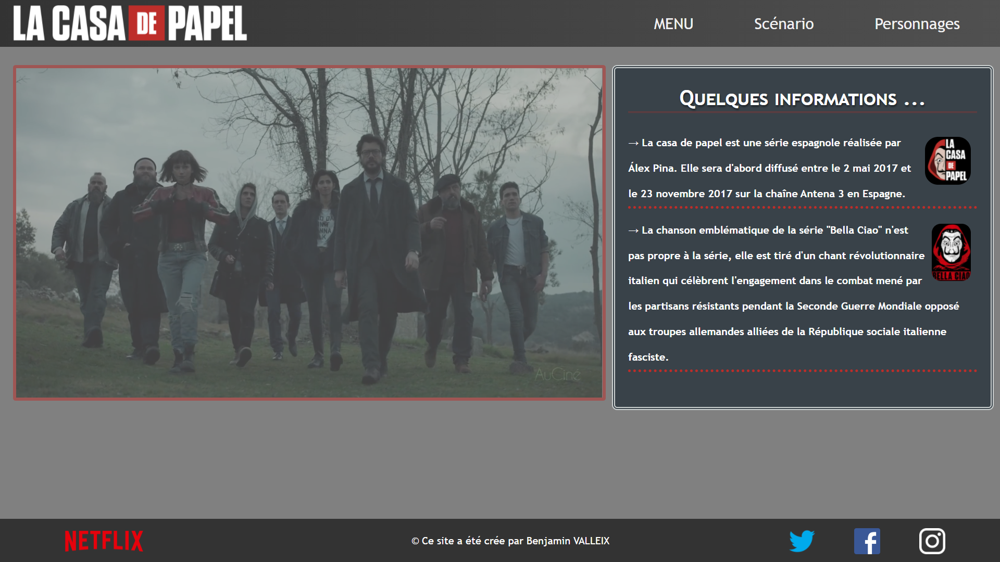

<h1 align="center"> Casa De Papel 👋</h1>

> Vous voulez en savoir plus sur la série qui as connu un succès mondial, vous êtes au bon endroit !

### 🏠 [Homepage](https://github.com/B3njaminV/html-casadepapel-website)

## ✏️ Auteur

👤 **VALLEIX Benjamin**

* Github: [@B3njaminV](https://github.com/B3njaminV)
* LinkedIn: [@Benjamin VALLEIX](https://www.linkedin.com/in/benjamin-valleix)

## 📝 License

Copyright © 2020 Benjamin VALLEIX

## 🛠 Languages & Outils

 
     
	 
    
     

